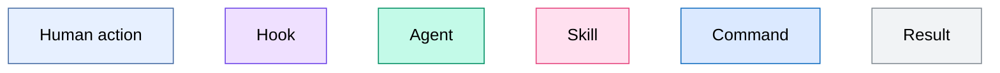
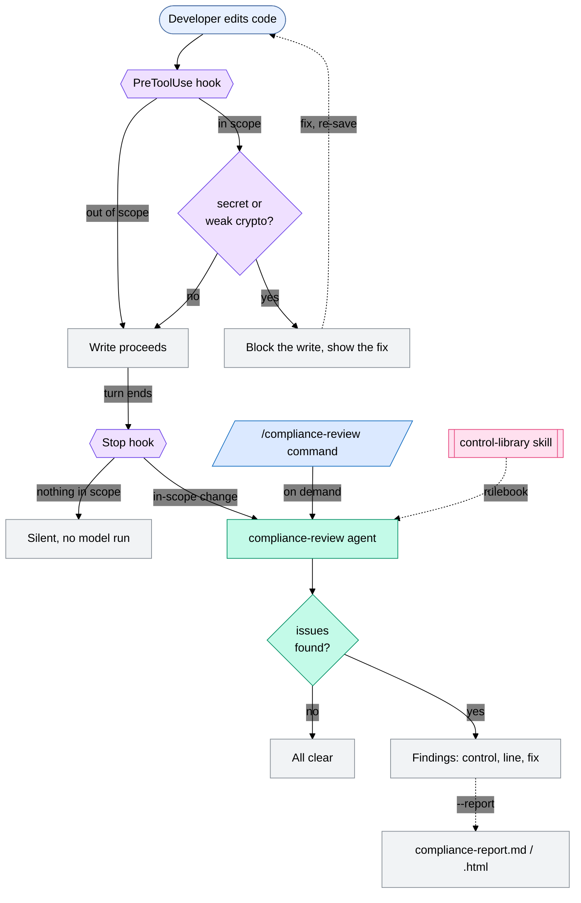

# Compliance Support

A PCI data-protection gate for Claude Code. It catches four data-protection mistakes (hardcoded secrets, weak crypto, personal or card data in logs, and money-moving code with no audit trail) at the keyboard, months before a pentest or a SOC 2 review would.

## Who it's for: Marcus

Marcus is a senior backend engineer (L5) on Capital One's Payments and Ledger squad. He owns the refunds service that issues and reverses card payments, so nearly every path he writes touches cardholder data and moves money. He ships three to five PRs a day. He knows the compliance rules exist without knowing their detail, and what he actually worries about is being the engineer who caused an audit finding. He already works in Claude Code, which is where this plugin meets him.

## The problem

Engineers like Marcus build the APIs that hold card data and move money, and every change has to satisfy PCI DSS, SOC 2, and GDPR: how the data is logged, encrypted, transmitted, and audited. Those rules live in long documents almost nobody reads. The security team that owns them is small and cannot review every pull request from thousands of engineers, so most code ships on trust.

So violations get written in good faith and found late, in a quarterly pentest or a SOC 2 evidence review, where they cost far more to fix than they would have at the keyboard, and where a single miss on a payments service turns into a real regulatory and reputational problem. Whole pods end up waiting on a compliance sign-off before they can merge to main, even at a bank that ships fast everywhere else.

This plugin moves the check to the moment the code is written. It also lets the security team encode their controls once, in a skill they own, so the same rules apply on every engineer's machine without a person reviewing each pull request.

## How it works

Two gates over the same scope.

- Gate 1, as you write. A PreToolUse hook blocks hardcoded secrets and weak cryptography before the file is saved. It runs no model and costs nothing, and it only fires on patterns that are never acceptable.
- Gate 2, when you finish. A Stop hook runs a review agent over the in-scope files you changed that turn, looking for the two things a pattern match cannot judge: personal or card data written to a log, and a money-moving action that returns with no audit entry. It advises, it does not block.

## What's in the plugin

| Component                                        | Primitive         | What it does                                                                         | Why this primitive                                                                                      |
| ------------------------------------------------ | ----------------- | ------------------------------------------------------------------------------------ | ------------------------------------------------------------------------------------------------------- |
| `agents/compliance-review.md`                  | Agent             | The two judgment calls: PII in logs, and a money move with no audit entry            | Both need reasoning a regex cannot do, and a single false positive teaches engineers to ignore the gate |
| `skills/control-library/SKILL.md`              | Skill             | The control rulebook: the violation, the approved fix, and the standard each maps to | Editable knowledge with no code, so compliance can change a control without touching the agent          |
| `scripts/scan.sh` → `scan.py`               | Hook (PreToolUse) | Blocks secrets and weak crypto on write                                              | The write has to stop deterministically, before any model, at no cost                                   |
| `scripts/review_gate.sh` → `review_gate.py` | Hook (Stop)       | Fires the review when the turn ends                                                  | Zero friction, nothing for the engineer to remember to run                                              |
| `/compliance-support:compliance-review`        | Command           | Runs the review on demand, with`--report` for a shareable report                   | A manual entry point for when you want one                                                              |
| `.compliance.yml`                              | Config            | The in-scope PCI paths                                                               | One place for scope that both hooks and the agent read                                                  |

## Architecture

**Key**





The control-library skill is the rulebook the compliance-review agent reads before it reviews: the violation, the fix, and the standard each control maps to. It is a skill rather than rules hardcoded into the agent, so a compliance owner can change a control as plain text without touching code.

Why it is built this way. The scan stays deterministic for the patterns that are always wrong, and a model runs only where judgment is unavoidable, which keeps the cost near zero and the false-positive rate low. I used hooks rather than an MCP server because the trigger is code being written, a local event, not an external system to call. The hooks are thin `.sh` wrappers so they behave the same on macOS and on Windows git-bash, and they fail open: if Python is not on the path, the gate allows the write rather than blocking someone's work over a broken scanner.

## Requirements

Claude Code, Python 3, and bash (Git Bash on Windows). The hooks run through small `.sh` wrappers.

## Installation

```bash
git clone https://github.com/Juantomasgomez7/compliance-support.git
cd compliance-support
claude plugin validate . --strict   # expect: ✔ Validation passed
claude --plugin-dir .
```

The plugin loads for that session. Launch from the repo root where `.compliance.yml` lives; started from a subdirectory the gate finds no scope config and stays silent.

## Try it in under 5 minutes

Everything here runs on the bundled `examples/refunds-service/` fixture, so there is no real code and nothing to set up.

Fast path, about two minutes. Run:

```
/compliance-support:compliance-review examples/refunds-service/src/api/handlers/refund.py
```

It flags the card number in a log line and the refund that returns with no audit entry, names the control and the line, and shows the fix. It does not edit your code. Add `--report` to also write a shareable report, as Markdown and as an HTML file that opens in a browser.

A few more things to try:

- Block on write. Ask Claude to add `examples/refunds-service/src/api/handlers/payout.py` that calls the processor with a hardcoded `PROCESSOR_API_KEY = "sk_live_..."` and `verify=False`. The write is blocked, with the control and the fix.
- Scope precision. Put the same key in `scripts/dev_seed.py` and the write goes through, because that path is out of PCI scope.
- The automatic gate. Add a log line to `refund.py`, then let Claude finish its turn. The Stop hook notices the in-scope change and reviews it with no command typed.

Reset the fixture with `bash scripts/demo_reset.sh`.

## Checks

| Check                                               | When                    | Control                         |
| --------------------------------------------------- | ----------------------- | ------------------------------- |
| Hardcoded secret or credential                      | blocks on write         | PCI Req 8                       |
| Weak crypto (MD5, DES, ECB) or TLS verification off | blocks on write         | PCI Req 3 & 4, SOC 2 CC6.7      |
| Personal or cardholder data in logs or errors       | turn-end, or on request | PCI Req 3 & 10, GDPR Art 5 & 32 |
| Money-moving action with no audit-log entry         | turn-end, or on request | SOC 2 CC7.2, PCI Req 10         |

Reviews flag issues for an engineer to fix. They are not an audit sign-off. Every control, with its violation and fix, is defined in `skills/control-library/SKILL.md`.

## Scope and coverage

`.compliance.yml` lists the in-scope paths. To cover another service, add its path; both hooks and the agent read this one file.

Coverage is bounded to writes that go through Claude Code, because a hook only sees its own host's actions. Code that arrives another way produces no hook event and relies on whatever already guards it.

## Testing and evaluation

Two kinds of check, tested two ways. The deterministic hooks have golden block/allow tests, and the agent is measured for precision and recall against a labeled fixture.

```bash
bash eval/hook/test_hook.sh              # golden tests for the write-time blocker
python -m unittest discover -s tests     # unit tests for the Stop gate and the report renderer
python eval/run_eval.py                  # agent precision and recall on eval/cases.yml
```

See `eval/README.md` for how the two approaches split.

## Docs

- [`docs/compliance-report.md`](docs/compliance-report.md): customizing and regenerating the branded report.
- [`docs/build-your-own-plugin.md`](docs/build-your-own-plugin.md): the primitives used here, and how to build your own plugin for a different workflow.

## Ownership and governance

The split is the obvious one. Engineering owns the mechanics: the hooks, the agent, and the report. Application security and compliance own the substance: the control-library skill and the in-scope paths in `.compliance.yml`.

That is why the rules live in a skill instead of in code. When a standard changes or a new control is needed, security edits `skills/control-library/SKILL.md` directly: add the control, change the approved fix, or adjust scope. It is plain markdown, so there is no engineering ticket, no code change, and no redeploy. The team that owns the controls is the team that edits them.

## License

MIT.