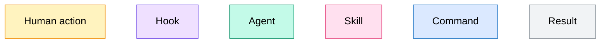
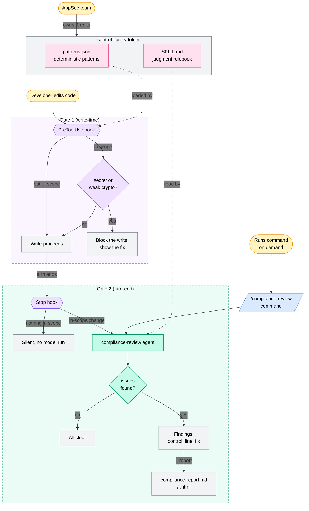

# Compliance Support

Compliance Support is a Claude Code plugin built for Capital One backend engineers who write code that touches PCI data. It catches four types of data-protection compliance breaches, two blocked the moment they are written and two flagged for review when the turn ends: 1. hardcoded secrets; 2. weak crypto; 3. PII or cardholder data written to a log; and 4. money-moving actions leaving no audit trail.

## Who it's for

This plugin is built with Marcus in mind. Marcus is a senior backend engineer on Capital One's Payments and Ledger squad. He owns the refunds service that issues and reverses card payments, so nearly every path he writes touches cardholder data. He ships three to five PRs a day and knows compliance rules exist but doesn't know their full detail. He constantly has to stay up to date with the changes the AppSec team enforces.

Marcus has been leveraging Claude Code on a basic level, but one of his biggest barriers to fully adopting it is the fear of having Claude Code ship something that causes an audit finding. Even when he ships without Claude Code, he lives with the constant stress of being the engineer who causes an accidental compliance breach.

This plugin is built for engineers like Marcus. If you don't touch code with cardholder data, this plugin is not for you: it stays silent on everything outside PCI scope.

## The problem

Every change to code that touches payment card surfaces has to satisfy PCI DSS, SOC 2, and GDPR regulations.

However, the enforcement of these regulations is owned by the application security team. At a bank the size of Capital One there is roughly one AppSec engineer for every 150 developers. One person cannot read every pull request from 150 engineers, so the rules end up in long documents almost nobody opens, and realistically most code ships on trust.

Violations get caught late in a pentest or a SOC 2 evidence review where they cost hundreds of times more to fix than they would had they been caught on time. A single miss on a payments service becomes a serious regulatory and reputational risk for the bank, and is considered a grave mistake for the AppSec team, as well as for the engineering team who shipped the code. No one benefits from the status quo.

Like Marcus, there are many hundreds of engineers at Capital One who face the exact same problem. There are also thousands more working on adjacent systems who could benefit from the same plugin shaped to their divisions' compliance frameworks.

## How the plugin solves this

By design, almost nothing changes for Marcus in his day-to-day. As long as he's leveraging Claude Code, the plugin will speak up if Marcus breaches a compliance standard.

**Compliance Standards:**

The compliance standards are owned and maintained centrally by the AppSec team in the control-library the plugin ships. The folder `skills/control-library/` holds a rulebook (`SKILL.md`) for the judgment calls, and also includes a set of deterministic detection patterns (`patterns.json`). Both are plain files AppSec edits directly, not code, so changing a rule takes no engineering ticket and no one reviewing each pull request by hand.

When Marcus writes code, the plugin runs a two-gate system, both gates reading from that one AppSec-owned library:

**Gate 1 runs as the code is being written:**

When Marcus sends a message and Claude goes to write a file, a PreToolUse hook fires. It checks the path against the scope in `.compliance.yml`, and if the file is in scope it scans the new content against the library's deterministic patterns: a hardcoded secret, weak crypto, TLS verification off.

If it finds one, the write is blocked before it lands and Marcus sees the control and the fix. No model runs, so it costs nothing. He never had to know it was PCI Requirement 8; the hook did thanks to the control-library.

**Gate 2 runs after the turn is finished:**

When Claude ends its turn, a Stop hook checks which in-scope files changed. If none did, it stays silent. If any did, it runs the compliance-review agent over them. The agent reads the control-library's rulebook (`SKILL.md`) for the current rules, then makes the two judgment calls a pattern match cannot: PII or cardholder data written to a log, and a money-moving action that returns with no audit-log entry. It flags what it finds, names the control, and points at the line. It advises, it does not block.

Both gates share one scope, defined in `.compliance.yml`. To cover another service, AppSec adds its path there. Coverage is bounded to writes that go through Claude Code, since a hook only sees its own host's actions; code that arrives another way must rely on external guards.

### What the plugin catches

| Control          | What it catches                                     | Gate                     | Maps to                           |
| ---------------- | --------------------------------------------------- | ------------------------ | --------------------------------- |
| **CTRL-1** | A hardcoded secret or credential                    | Gate 1 (blocks on write) | PCI Req 8                         |
| **CTRL-2** | Weak crypto (MD5, DES, ECB) or TLS verification off | Gate 1 (blocks on write) | PCI Req 3 & 4 · SOC 2 CC6.7      |
| **CTRL-3** | PII or cardholder data in logs or errors            | Gate 2 (turn-end review) | PCI Req 3 & 10 · GDPR Art 5 & 32 |
| **CTRL-4** | A money-moving action with no audit-log entry       | Gate 2 (turn-end review) | SOC 2 CC7.2 · PCI Req 10         |

Gate 2's two controls can also be run on demand with the `/compliance-support:compliance-review` command. Findings flag issues for an engineer to fix; they are not an audit sign-off.

## Installation

All you need is Claude Code, Python 3, and bash (Git Bash on Windows).

```bash
git clone https://github.com/Juantomasgomez7/compliance-support.git
cd compliance-support
claude plugin validate . --strict   # expect: ✔ Validation passed
claude --plugin-dir .
```

The plugin loads for that session. Launch from the repo root where `.compliance.yml` lives; started from a subdirectory the gate finds no scope config and stays silent.

To roll it out to a whole org instead, see [Governance and team rollout](#governance-and-team-rollout).

## Try it in under 5 minutes

Everything runs on the bundled `examples/refunds-service/` fixture, so there is no real code and nothing to set up.

Point the review at the example refund handler:

```
/compliance-support:compliance-review examples/refunds-service/src/api/handlers/refund.py
```

It returns the two judgment findings, with the control, the line, and the fix:

```
examples/refunds-service/src/api/handlers/refund.py

  CTRL-3  PII or cardholder data in logs  ·  line 19
    log.info("issuing refund %s for %s on card %s", refund_id, user.email, card.number)
    Fix: log the refund_id alone; drop user.email and card.number.

  CTRL-4  Money-moving action with no audit-log entry  ·  line 29
    issue_refund(...) returns without an audit_log.record(...) call.
    Fix: record the refund to the audit log after it succeeds.
```

It does not edit your code. Add `--report` to also write a shareable version, as Markdown and as a branded HTML file that opens in a browser.

Three more things to try:

- **Block on write.** Ask Claude to add `examples/refunds-service/src/api/handlers/payout.py` that calls the processor with a hardcoded `PROCESSOR_API_KEY = "sk_live_..."` and `verify=False`. The write is blocked, with the control and the fix.
- **Scope precision.** Put the same key in `scripts/dev_seed.py` and the write goes through, because that path is outside PCI scope.
- **The automatic gate.** Add a log line to `refund.py` and let Claude finish its turn. The Stop hook notices the in-scope change and reviews it, with no command typed.

Reset the fixture with `bash scripts/demo_reset.sh`.

## Governance and team rollout

**AppSec owns every control definition; engineering owns only the plumbing.** What counts as a violation never lives in code: all four controls live in the AppSec-owned control-library at `skills/control-library/`, and the in-scope paths live once in `.compliance.yml`. Engineering owns only the mechanism: the hooks, the agent wiring, and the report renderer. When a standard changes, security edits the control-library directly, plain markdown for a judgment control or one JSON entry for a deterministic pattern, with no engineering ticket, code change, or redeploy, and both gates immediately run the current version.

The repo is also a single-plugin marketplace, which is how an org rolls the plugin out and keeps it current:

```
/plugin marketplace add Juantomasgomez7/compliance-support
/plugin install compliance-support@compliance-support
```

To ship a rule change, AppSec edits the control-library, bumps the `version` in the manifest, and pushes. Each engineer picks it up with `/plugin update`, or automatically at session start if the org enables auto-update for the marketplace. One central, versioned source, instead of the same rule pasted into a thousand local setups.

## How it's built

### Primitives this plugin uses

| Part                                                           | Primitive         | What it does                                                                                                                                                                                  | Why this primitive                                                                                                                      |
| -------------------------------------------------------------- | ----------------- | --------------------------------------------------------------------------------------------------------------------------------------------------------------------------------------------- | --------------------------------------------------------------------------------------------------------------------------------------- |
| `skills/control-library/` (`SKILL.md` + `patterns.json`) | Skill             | The AppSec-owned control library feeding both gates:`SKILL.md` is the rulebook the agent reads (CTRL-3/4); `patterns.json` is the deterministic patterns the Gate 1 hook loads (CTRL-1/2) | Editable knowledge and data with no code, so compliance can change any control, for either gate, without touching the hook or the agent |
| `scripts/scan.sh` → `scan.py`                             | Hook (PreToolUse) | Gate 1: loads the control-library's`patterns.json` and blocks hardcoded secrets and weak crypto before the write lands                                                                      | The write has to stop deterministically, before any model, at no cost                                                                   |
| `scripts/review_gate.sh` → `review_gate.py`               | Hook (Stop)       | Gate 2: runs the review when Claude finishes a turn                                                                                                                                           | Zero friction, nothing for the engineer to remember to run                                                                              |
| `agents/compliance-review.md`                                | Agent             | Makes Gate 2's two judgment calls: PII or cardholder data in logs, and a money move with no audit-log entry                                                                                   | Both need reasoning a regex cannot do, and a single false positive teaches engineers to ignore the gate                                 |
| `/compliance-support:compliance-review`                      | Command           | Runs the Gate 2 review on demand, with`--report` for a shareable report                                                                                                                     | A manual entry point for when you want one                                                                                              |

Two files carry data, not behavior, so they get no row above: `.compliance.yml` (the scope) and `patterns.json` (the detection rules, data inside the control-library skill).

### Architecture

**Key**





Why it is built this way (a deterministic gate for the always-wrong patterns, a judgment agent only where it is unavoidable, hooks over an MCP server, and fail-open wrappers) is written up in [design notes](docs/design-notes.md).

## Testing and evaluation

Two kinds of check, tested two ways: golden block/allow tests for the deterministic hooks, and a precision/recall eval for the agent against a labeled fixture.

```bash
bash eval/hook/test_hook.sh              # golden tests for the write-time blocker
python -m unittest discover -s tests     # unit tests for the Stop gate and the report renderer
python eval/run_eval.py                  # agent precision and recall on eval/cases.yml
```

## Docs

- [`docs/build-your-own-plugin.md`](docs/build-your-own-plugin.md): the primitives used here, and how to build your own plugin for a different workflow.
- [`docs/design-notes.md`](docs/design-notes.md): the interesting build decisions, and where I had to steer Claude Code.
- [`docs/compliance-report.md`](docs/compliance-report.md): customizing and regenerating the branded report.
- [`eval/README.md`](eval/README.md): how the deterministic and judgment checks are evaluated.

## License

MIT.
